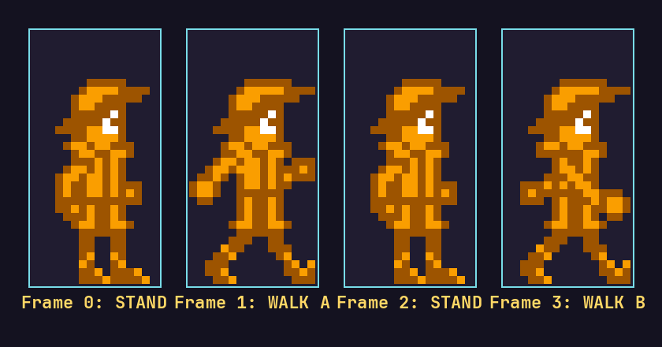
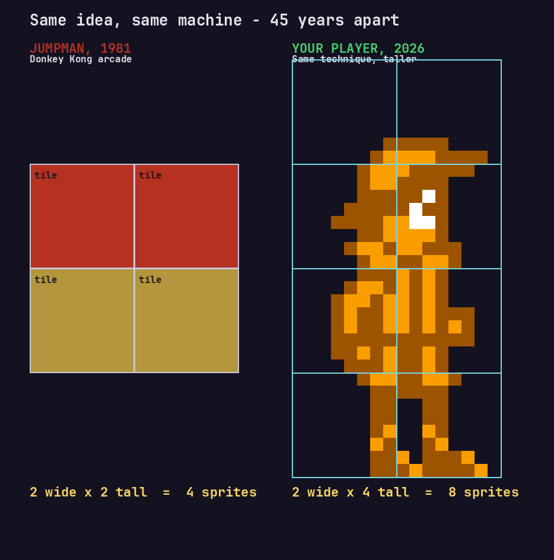
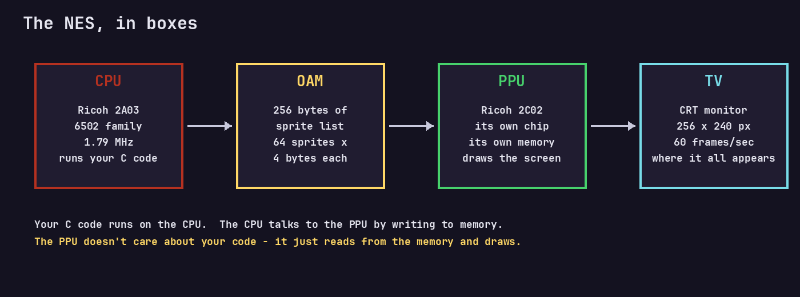
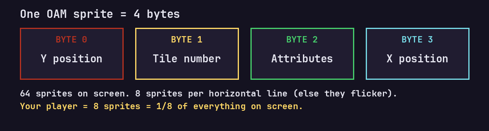
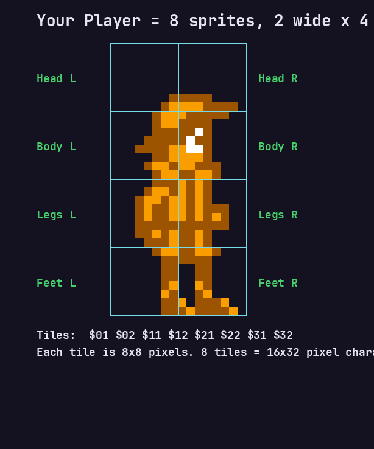
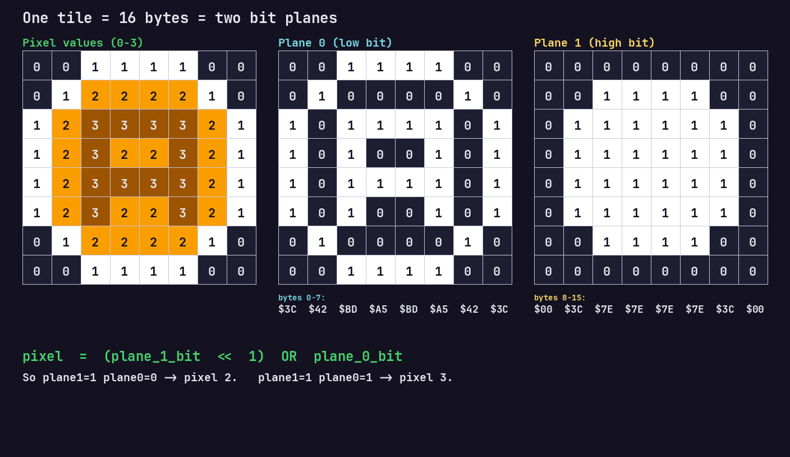
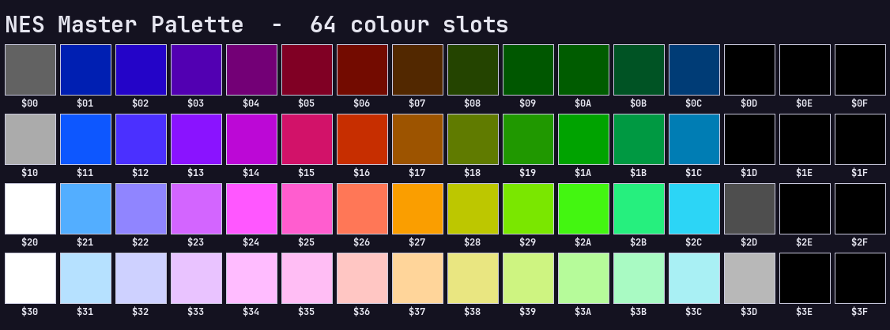

<!-- _class: title -->

# STEP 1
## Your First NES Sprite

**Power on the 2A03.** Wake the PPU.
Put a hero on screen like it's 1985.

<span class="small">Zelda II Quest — Training Hall</span>

---

## The Mario Moment

<div class="fact">
In <strong>1981</strong>, a young Nintendo designer named <strong>Shigeru Miyamoto</strong>
drew a carpenter in red overalls because red and blue were the only colours
that didn't blur on arcade CRTs. He called him <strong>Jumpman</strong>.

Four years later, on the same kind of hardware you are about to program,
Jumpman became <strong>Mario</strong>.
</div>

> You are starting where Miyamoto started.
> Same 6502. Same PPU. Same 64 sprites.

---

## What you'll have by the end of Step 1



- A **16×32 hero sprite** you can see on screen
- A **walk animation** (4 frames)
- **D-Pad movement** left/right
- A **jump button** with real gravity
- Your name in the commit log of a real NES ROM

<span class="small">Time: as long as you want. Ten minutes is fine. Two hours is fine.</span>

---

## From Jumpman to your hero



**Same trick:** stack small 8×8 tiles into a bigger character.
<span class="small">Nintendo never had "big sprites". They faked them — and so will you.</span>

---

## The machine you're programming



<div class="fact">
Two chips, talking through memory.
The <strong>CPU</strong> thinks. The <strong>PPU</strong> draws. They never see each other directly.
</div>

---

## Meet the 6502

<div class="fact">
The <strong>MOS 6502</strong> cost <strong>$25</strong> in 1975 when Motorola's chip cost $300.
It powered the Apple II, Commodore 64, Atari 2600, BBC Micro, and the NES.

Nintendo's version (<strong>Ricoh 2A03</strong>) added sound and stripped decimal mode
to dodge a patent. It runs at <strong>1.79 MHz</strong> — your phone is ~2000× faster.
</div>

Your C code compiles down to 6502 assembly.
**Every variable. Every `if`. Every `while`.**

---

## Talking to the PPU

```c
#define PPU_CTRL      *((unsigned char*)0x2000)
#define PPU_MASK      *((unsigned char*)0x2001)
#define PPU_ADDR      *((unsigned char*)0x2006)
#define PPU_DATA      *((unsigned char*)0x2007)
```

These aren't variables — they are **doorbells**.

Writing to `$2006` tells the PPU *"listen up, here's an address"*.
Writing to `$2007` says *"put this byte there"*.

<span class="small">Exactly how Super Mario Bros. loads every cloud, pipe, and coin.</span>

---

## Reading the controller

```c
JOYPAD1 = 1;   // "Strobe!" Freeze the buttons.
JOYPAD1 = 0;   // "Now read."
for (i = 0; i < 8; i++) {
    result = result << 1;
    if (JOYPAD1 & 1) result = result | 1;
}
```

<div class="fact">
The NES pad is a <strong>shift register</strong>. You pulse it, then read one button per clock:
<strong>A, B, Select, Start, Up, Down, Left, Right.</strong>
Tetris, Contra, Zelda — <strong>every</strong> NES game does exactly this.
</div>

---

## OAM — where sprites live



**4 bytes × 64 sprites = 256 bytes of OAM.**
That's your entire cast. Mario, Goombas, fireballs — all fit in 256 bytes.

---

## The 8-per-line rule

<div class="warn">
The PPU can only draw <strong>8 sprites per horizontal scanline</strong>.
Sprite #9 on that line? <strong>Invisible.</strong>
</div>

This is why NES games flicker when it gets crowded.
Mega Man's helmet bobs behind enemies. That's not a bug — that's **the rule**.

<span class="small">Nintendo's trick: rotate which sprite gets skipped each frame, so flicker
replaces disappearance. You'll see this yourself if you draw too many gems.</span>

---

## Your hero is 8 sprites



<div class="fact">
<strong>16 pixels wide × 32 pixels tall</strong> = 2 tiles × 4 tiles = <strong>8 OAM entries.</strong>
Link in Zelda II? Same layout. Simon in Castlevania? Same layout.
</div>

---

## How a tile is actually stored



**Two bit-planes per tile.** Bit 0 from plane 0, bit 1 from plane 1.
Combined value (0–3) picks a colour from the palette.

<span class="small">This is the format <strong>every</strong> NES tile uses. Your `walk1.chr` file is just
hundreds of these, back to back.</span>

---

## Animation — Miyamoto's 4 frames


```c
frame = moved % 4;
tiles = anim_tiles[frame];
```

<div class="fact">
Miyamoto hand-tuned Mario's walk until it <em>felt</em> right — not realistic, right.
Four frames. That's all you need for the illusion of walking.
</div>

Each button press ticks `moved`. Every 4th tick, you loop.

---

## The palette law

<div class="warn">
<strong>NES rule:</strong> each sprite uses <strong>4 colours</strong>, and one of them MUST be transparent.
You get <strong>4 sprite palettes</strong>, total. That's <strong>12 unique sprite colours</strong> on screen.
</div>

This is why Mario wears **red**, Luigi wears **green**,
and their skin is the **same peach** — shared palette.

---

## The full NES palette



<div class="fact">
<strong>64 colours, hard-wired in silicon.</strong> You don't mix — you pick.
(Some are duplicates of black. Nintendo, honestly.)
</div>

Your player palette is just 3 of these, plus transparent.

---

## The game loop

```c
while (1) {
    pad = read_controller();     // 1. What's the human doing?
    // ...update x, y, jump timer, animation frame...
    waitvsync();                 // 2. Wait for the TV to finish drawing
    OAM_ADDR = 0;                // 3. Push sprites to the PPU
    draw_player();
}
```

<div class="fact">
Every NES game from 1983 to 1994 runs this loop <strong>60 times a second</strong>.
Miss one <code>waitvsync()</code> and the screen tears. This is the <strong>heartbeat</strong>.
</div>

---

## Jump & gravity

```c
if (pad & 0x08) {                    // Up pressed
    if (jump == 1 && jmptime <= 0) {
        y = y - 3;                   // push up
        jmptime = 15;                // arc length
    }
}
if (y < 176) {                       // not on floor?
    if (jmptime > 0) { jmptime--; y -= 3; }   // still rising
    else              { y += 3; }              // falling
}
```

<span class="small">SMB's jump is the <strong>most iterated-on 20 lines of code in history</strong>. Miyamoto
re-tuned it thousands of times. Yours is the same shape.</span>

---

## Your mission — Step 1

1. **Build it.** Press `Ctrl+Shift+B`. Watch FCEUX open.
2. **Move the hero.** D-Pad left/right. Jump with Up.
3. **Break things on purpose.** Look for `// TRY:` comments.

<div class="fact">
🎯 <strong>Experiments:</strong>
<ul>
  <li>Change <code>jmptime = 15;</code> to <code>25</code> — moon jump.</li>
  <li>Change <code>y = y - 3;</code> to <code>y = y - 6;</code> — rocket hero.</li>
  <li>Change a palette byte: <code>0x27</code> (orange) → <code>0x22</code> (blue). You've recoloured your sprite.</li>
</ul>
</div>

---

## Sprite editing — the Nintendo way

Open `tools/generate_chr.py`. Find `sprite_head_left()`.

```python
pattern = [
    "..XXXX..",     # X = pixel on, . = transparent
    ".XXXXXX.",
    "XX.XX.XX",
    "XX.XX.XX",
    ...
]
```

<div class="fact">
Nintendo's artists drew on <strong>graph paper</strong> before they had tools.
Miyamoto famously designed Mario's cap on a napkin because the original
art tools couldn't show pixels clearly. You're using better tools than he had.
</div>

---

## Backgrounds — a taste

Sprites are the *actors*. **Backgrounds** are the *stage*.

- A **nametable** is a grid of 32×30 tile indices — a level map.
- The PPU reads it every frame and draws the stage.
- Scrolling Mario's world? Just nudging `PPU_SCROLL` each frame.

<span class="small">We'll build backgrounds properly in Step 2. For now, enjoy your blue sky —
it's a single palette byte: <code>0x21</code>.</span>

---

## What you just did

✅ Programmed a **real 6502**.
✅ Talked to the **PPU** like Nintendo did.
✅ Assembled **8 hardware sprites** into a hero.
✅ Wrote a **game loop** that runs at **60 Hz**.
✅ Tuned **jump physics** (the hardest problem in game design, honestly).

**You are now a NES developer.** That's not a joke. The code you wrote would boot on original 1983 hardware.

---

<!-- _class: title -->

# End of Step 1

### Next up: **Step 2 — Backgrounds**
*Build the world. Load a level. Make it feel like somewhere.*

<span class="small">Save your game. Close FCEUX. Be proud of the commit hash.</span>
